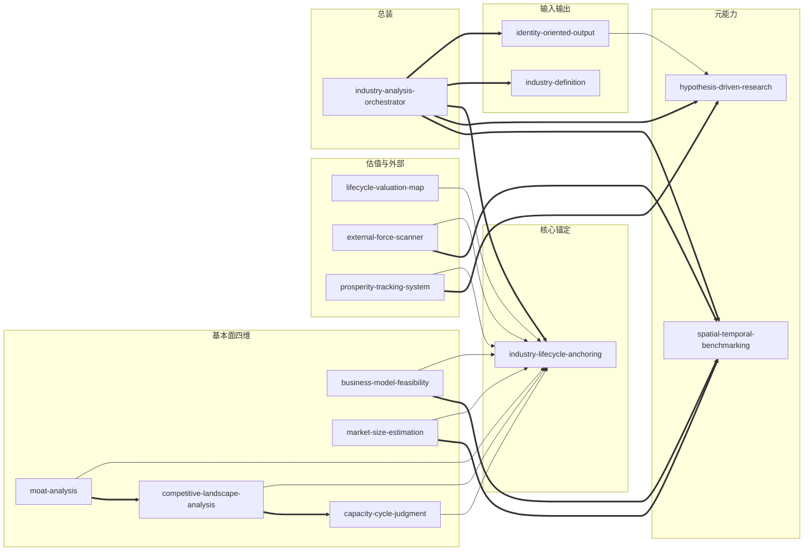

# 《如何快速了解一个行业》技能库

> 基于肖璟《如何快速了解一个行业》方法论，构建的模块化行业研究技能库。
> 采用 RI-A1-A2-E-B 六段结构，每个子技能可独立调用，也可通过 orchestrator 一键调度。

---

## 技能全景

### 🚀 总成入口（1 个）— 从这里开始

| Skill | Slug | 一句话 |
|-------|------|--------|
| **行业分析总成** | `industry-analysis-orchestrator` | 🌟 **统一入口**：输入行业名，自动调度全部子技能，输出结构化分析报告 |

> 💡 **使用方式**: 直接说"帮我分析XX行业"，orchestrator 会按产业生命周期流水线依次调用身份确认→定义→定位→假设→对标→加权分析→估值→外部→景气度→报告输出。

### 元能力（2 个）

| Skill | Slug | 一句话 |
|-------|------|--------|
| 假设驱动研究法 | `hypothesis-driven-research` | "怎么做研究"的底层方法论——金字塔原理/SCQR/DIKW/MECE |
| 时空对标推理法 | `spatial-temporal-benchmarking` | 用过去和他处理解当下和此处——时间对标/空间对标/终局对标 |

### 核心锚定（1 个）

| Skill | Slug | 一句话 |
|-------|------|--------|
| 产业生命周期定位术 | `industry-lifecycle-anchoring` | 用渗透率判断行业阶段，决定"现在该分析什么" |

### 基本面四维（5 个）

| Skill | Slug | 所属阶段 | 一句话 |
|-------|------|----------|--------|
| 商业模式可行性验证 | `business-model-feasibility` | 导入期重点 | 验证"这个模式能不能跑通" |
| 市场规模测算 | `market-size-estimation` | 成长期重点 | 量化"天花板到底有多高" |
| 护城河分析 | `moat-analysis` | 成熟期重点 | 判断"利润能不能守住" |
| 竞争格局分析 | `competitive-landscape-analysis` | 成熟期重点 | 拆解"同行/上下游谁赚得最多" |
| 产能周期判断法 | `capacity-cycle-judgment` | 成熟期(周期场景) | 判断"产能过剩到哪一步了" |

### 估值与外部（3 个）

| Skill | Slug | 适用范围 | 一句话 |
|-------|------|----------|--------|
| 产业生命周期估值地图 | `lifecycle-valuation-map` | 跨阶段 | 根据生命周期阶段选择估值框架 |
| 外部驱动力扫描（PEST+） | `external-force-scanner` | 跨阶段 | 扫描外部变量如何修正基本面判断 |
| 景气度追踪体系 | `prosperity-tracking-system` | 跨阶段 | 用高频指标验证中长期判断 |

### 输入输出（2 个）

| Skill | Slug | 一句话 |
|-------|------|--------|
| 行业定义与边界 | `industry-definition` | 确定分析范围和产业链结构 |
| 身份导向输出 | `identity-oriented-output` | 根据用户身份定制分析方案和叙事结构 |

---

## 技能关系图



---

## 关系明细

| # | 源技能 | 关系类型 | 目标技能 | 说明 |
|---|--------|----------|----------|------|
| 1 | lifecycle-valuation-map | depends-on | industry-lifecycle-anchoring | 估值需先知道行业处于哪个阶段 |
| 2 | capacity-cycle-judgment | depends-on | industry-lifecycle-anchoring | 产能周期是成熟期"稳定周期化"的子周期 |
| 3 | prosperity-tracking-system | depends-on | industry-lifecycle-anchoring | 景气度追踪是在已确定的阶段内做验证 |
| 4 | business-model-feasibility | depends-on | industry-lifecycle-anchoring | 只有确定导入期后才启动深度可行性验证 |
| 5 | market-size-estimation | depends-on | industry-lifecycle-anchoring | 成长期才启动完整市场规模测算 |
| 6 | moat-analysis | depends-on | industry-lifecycle-anchoring | 成熟期才启动深度护城河分析 |
| 7 | competitive-landscape-analysis | depends-on | industry-lifecycle-anchoring | 成熟期才启动深度竞争格局分析 |
| 8 | external-force-scanner | depends-on | industry-lifecycle-anchoring | 外部因素对所有阶段都有影响，但分析框架需先明确阶段 |
| 9 | business-model-feasibility | composes-with | spatial-temporal-benchmarking | 时间/空间对标是可行性验证的核心工具 |
| 10 | market-size-estimation | composes-with | spatial-temporal-benchmarking | 终局对标为市场规模测算提供有参照的假设 |
| 11 | moat-analysis | composes-with | competitive-landscape-analysis | 防守性+盈利性构成成熟期二维分析矩阵 |
| 12 | external-force-scanner | composes-with | spatial-temporal-benchmarking | PEST校验时空对标的"环境可比"前提 |
| 13 | prosperity-tracking-system | composes-with | hypothesis-driven-research | 景气度指标是假设验证步骤的具体实践 |
| 14 | competitive-landscape-analysis | composes-with | capacity-cycle-judgment | 产能周期位置决定竞争格局变化方向 |
| 15 | identity-oriented-output | depends-on | hypothesis-driven-research | SCQR叙事框架是身份输出方案的理论基础 |
| 16 | moat-analysis | contrasts-with | competitive-landscape-analysis | 单家防守 vs 行业利润分配 |
| 17 | external-force-scanner | contrasts-with | prosperity-tracking-system | 中长期结构变量 vs 高频交易指标 |
| 18 | hypothesis-driven-research | contrasts-with | spatial-temporal-benchmarking | 演绎验证 vs 类比推理 |

---

## 推荐学习顺序

```
第 1 步：hypothesis-driven-research        ← 元能力，无前置依赖
第 2 步：spatial-temporal-benchmarking     ← 推理框架，无前置依赖
第 3 步：industry-lifecycle-anchoring      ← 核心锚，建议先掌握元能力再学
第 4 步：industry-definition               ← 基础能力，无前置依赖
第 5 步：business-model-feasibility        ← 导入期应用
第 6 步：market-size-estimation            ← 成长期应用
第 7 步：moat-analysis                     ← 成熟期（可与第8步并行）
第 8 步：competitive-landscape-analysis    ← 成熟期（可与第7步并行）
第 9 步：capacity-cycle-judgment           ← 成熟期"周期化"场景
第 10 步：lifecycle-valuation-map          ← 需理解四个基本面维度后
第 11 步：external-force-scanner           ← 需理解所有基本面后才能修正判断
第 12 步：prosperity-tracking-system       ← 需理解整个框架后才能做持续验证
第 13 步：identity-oriented-output         ← 需理解SCQR后才能做受众适配
```

---

## 审计轨迹

| 阶段 | 日期 | 内容 | 状态 |
|------|------|------|------|
| 模块化解耦 | 2026-06-10 | 将 ~1200行 SKILL.md 拆解为 14 个独立子技能 + 4 个参考文件 | ✅ 完成 |
| 结构标准化 | 2026-06-10 | 每个子技能完成 RI-A1-A2-E-B 六段结构 | ✅ 完成 |
| 关系建模 | 2026-06-10 | 识别 18 条技能间关系（9 depends-on + 6 composes-with + 3 contrasts-with） | ✅ 完成 |
| 批判整合 | 2026-06-10 | 基于 BOOK_OVERVIEW.md 的系统批判注入每个子技能的 B 字段 | ✅ 完成 |
| StockReview 桥接 | 2026-06-14~16 | 初版 historical-case-matching 桥接 skill → 发现与 StockReview 原生 historical-stage-benchmarking 方法论重复 → 降级为 reference 交接文档（见 reference/如何接入StockReview做历史对照.md） | ✅ 完成 |

### 关系统计

| 关系类型 | 数量 | 说明 |
|----------|------|------|
| depends-on | 9 | 核心锚被8个技能依赖 + identity依赖hypothesis |
| composes-with | 6 | 工具技能被组合使用 |
| contrasts-with | 3 | 代表不同分析路径 |
| **合计** | **18** | |

---

### v2.5.0 更新日志（从原有SKILL.md继承）

基于对原著全文的系统审视，此版本补全了此前缺失的关键方法论并修正错误：

**v2.5.0 新增方法论：**
- 🔴 金字塔原理：构建金字塔的四步法、"总结vs提炼"区分、"那又怎样？"深度追问
- 🔴 SCQR叙事框架："空雨湿伞"模型 + 按四种受众调整叙事顺序
- 🟡 专家访谈技巧：能力圈判断、绕开保密协议、启发式追问
- 🟡 研报筛选四法：热度→团队→推荐→内容
- 🟡 搜索引擎高级操作符：site:/filetype:/双引号/减号/通配符
- 🟡 FOMO警示：在未建立深度差前警惕盲目追求广度

**v2.5.0 错误修正：**
- 🔧 修正渗透率阈值与创新扩散理论的机械对应
- 🔧 修正护城河分析要求：从"至少覆盖两种"改为"根据行业特性选择2-3类"
- 🔧 生命周期优先级矩阵加入行业特性例外条款
- 🔧 数据时效规则加入弹性例外条款

**v2.4.0 新增：**
- 🔴 创新扩散理论、产能周期分析、库存周期
- 🟡 货币三种价格、经济发展水平分析、Gartner技术成熟度曲线、创新层级金字塔
- 🟡 DIKW模型、事实判断vs价值判断、信息茧房意识、MECE原则
